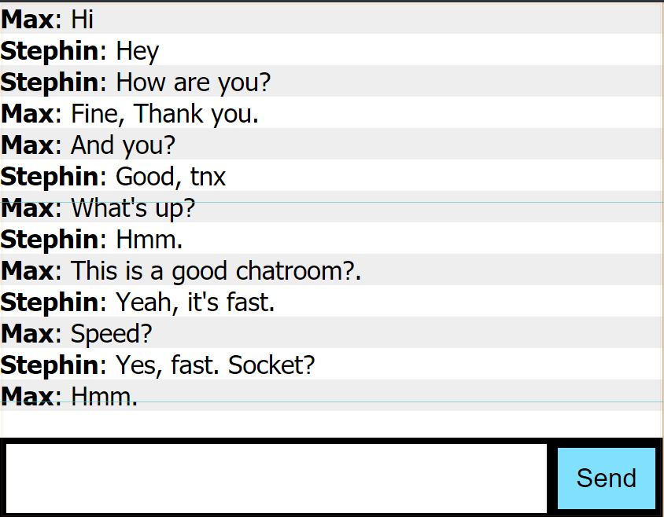

# Live Web Chat Socket

A mini project for personal chat messaging in a cloud-based server.



## Execute and Serve

```
$ node app.js
```

## Using and Test

- Open http://localhost:5000 (Put your server ip instans of localhost)
- Chat and enjoy!
